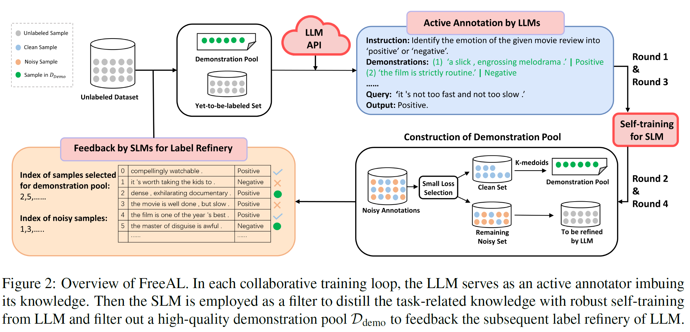

# FreeAL
This is the PyTorch implementation of our EMNLP 2023 paper FreeAL. The code will be uploaded soon.
# FreeAL: Towards Human-Free Active Learning in the Era of Large Language Models

This is the implementation of our EMNLP 2023 paper [FreeAL](https://aclanthology.org/2023.emnlp-main.896/). 

**Title:** FreeAL: Towards Human-Free Active Learning in the Era of Large Language Models

**Authors:** Ruixuan Xiao, Dong Yiwen, Junbo Zhao, Runze Wu, Minmin Lin, Gang Chen, Haobo Wang

**Affliations:** Zhejiang University, NetEase Fuxi AI Lab


### Overview

In this paper, we overhaul the traditional active learning and propose a collaborative framework FreeAL, which employ LLMs as active annotators and SLMs as weak filters to distill task-related knowledge from LLMs. An overview of FreeAL can be seen as follows:



In each training loop, we alternate the following steps:

* Active labeling of the to-be-labeled samples via LLMs based on feedback from SLMs.
* Training weakly supervised SLMs to distill the task-related knowledge from the noisy annotations of LLMs and in turn feedback to them.


### Requirements

After creating a virtual environment, run

```
pip install -r requirements.txt
```


### Data preparation

We mainly evaluate our framework on sequence-level tasks and token-level tasks, including SST-2, MR, SUBJ, TREC, MA (Medical Abstract), CoNLL03, and BC5CDR datasets. All the datasets we used are publicly available datasets. The data for SLMs should be placed under the `data-in` folder with the following structure:

```
data-in
 |-- mr  # data for mr datasets
 |    |-- train.csv # vanilla training data (for transductive testing)
 |    |-- train_chatbt.csv  # training data with augmentations and LLM-generated-labels
 |    |-- dev.csv  
 |    |-- test.csv  # test data (for inductive testing)
 |    |-- ...
 |-- sst2  # data for sst2 dataset
 |    |-- ...
 |--subj  # data for subj dataset
 |    |-- ...
```

The backtranslation script is in `backtrans.py`


### How to run

We put the source code of active labeling by LLMs and self-training of SLMs in folder `active_labeling_llm` and `self_training_slm` respectively. FreeAL employs iterative paradigm of training. In the initial and the subsequent training loops, the details of collaborative training are slightly different.

##### Active labeling of LLMs

First, configure your openai API key in the `openai_api_config.yml` file. Notably, we adopt [openai-manager](https://github.com/MrZilinXiao/openai-manager) which leverages multiple API keys in parallel for accelerated inference. You can also opt out and utilize the vanilla official API sample. The original dataset and self-generated demonstrations with corresponding sample embeddings should be put in `embedding` folder, which can be downloaded from [this link](https://drive.google.com/drive/folders/1U45ak3up69CKYHCKCl3FWFResM-mbOWZ?usp=drive_link). 

After that, simply run 

	python active_labeling_llm.py

for the initial round, and 

	python active_labeling_llm.py --refinery

for the subsequent rounds with the feedbacks in the folder `../self_training_slm/feedback`.

##### Robust self-training of LLMs

Prior to execution, make sure that the `data_in` folder is configured with annotations from the last round of LLMs (this can be accomplished using  simple script). Then just run the shell script

After that, simply run 

	CUDA_VISIBLE_DEVICES=0 bash run_roberta_mr.sh tranductive

for transductive setting, and  

	CUDA_VISIBLE_DEVICES=0 bash run_roberta_mr.sh inductive

for inductive setting.
We will continue to improve the imperfections in our code!


### How to cite

```
@inproceedings{xiao-etal-2023-freeal,
    title = "{F}ree{AL}: Towards Human-Free Active Learning in the Era of Large Language Models",
    author = "Xiao, Ruixuan  and
      Dong, Yiwen  and
      Zhao, Junbo  and
      Wu, Runze  and
      Lin, Minmin  and
      Chen, Gang  and
      Wang, Haobo",
    editor = "Bouamor, Houda  and
      Pino, Juan  and
      Bali, Kalika",
    booktitle = "Proceedings of the 2023 Conference on Empirical Methods in Natural Language Processing",
    month = dec,
    year = "2023",
    address = "Singapore",
    publisher = "Association for Computational Linguistics",
    url = "https://aclanthology.org/2023.emnlp-main.896",
    doi = "10.18653/v1/2023.emnlp-main.896",
    pages = "14520--14535"
}
```